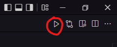

# Configurando o code runner no vscode

Para não precisar ficar compilando o nosso código manualmente toda vez que for executar um código e queremos ver apenas a saida dele, vamos utilizar o code runner pra fazer isso. Será criado um icone de run no canto superior direito do vscode:



Primeiro vamos instalar o ts-node:

```sh
yarn add ts-node -D
```

Depois procure por code runner em extensões no vscode ou faça o download pelo link [Baixar](https://marketplace.visualstudio.com/items?itemName=formulahendry.code-runner).

vamos criar uma pasta na raiz do nosso projeto chamada de .vscode contendo um arquivo chamado settings.json, dentro desse arquivo colocamos o seguinte:

```json
{
  "code-runner.executorMap": {
    "typescript": "npx ts-node --files",
  },
  "code-runner.runInTerminal": true,
}
```

A flag ```--files``` está relacionado ao include e exclude do tsconfig.json, que veremos mais adiante.

Você pode configurar pelo settings.json global do vscode se preferir as configurações contidas na pasta .vscode servirá apenas para esse projeto.
