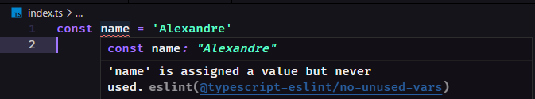

# ESLint

Instale a extensão [ESLint](https://marketplace.visualstudio.com/items?itemName=dbaeumer.vscode-eslint) no vscode.\
Depois instale o eslint:

```sh
yarn add eslint -D
```

Agora precisamos instalar as depêndencias que farão a integração do ESLint com typescript:

```sh
yarn add @typescript-eslint/eslint-plugin @typescript-eslint/parser -D
```

Você pode rodar o comando abaixo e ir preenchendo as informações:

```sh
yarn eslint --init
```

ou crie um arquivo .eslintrc.json na raiz do projeto e cole as informações abaixo:

```json
{
    "env": {
        "browser": true,
        "es2021": true,
        "node": true
    },
    "extends": [],
    "globals": {
      "Atomics": "readonly",
      "SharedArrayBuffer": "readonly"
    }
    "parser": "@typescript-eslint/parser",
    "parserOptions": {
        "ecmaVersion": "latest",
        "sourceType": "module"
    },
    "plugins": [
        "@typescript-eslint"
    ],
    "rules": {
    }
}

```

Execute um ```CTRL+SHIFT+P``` no vscode e de um reload window, pois as vezes as configurações não surtem efeito.\
Se colocarmos na aba ```OUPUT``` no vscode e selecionar ESLint devera estar da seguinte forma:

```log
[Info  - 8:06:00 PM] ESLint server is starting
[Info  - 8:06:00 PM] ESLint server running in node v16.13.0
[Info  - 8:06:00 PM] ESLint server is running.
[Info  - 8:06:01 PM] ESLint library loaded from: /home/usuario/dev/learning-typescript/node_modules/eslint/lib/api.js
```

**OBS:** A última linha pode variar de acordo com o sistema operacional que estiver utilizando, mas basicamente é o caminho até seu projeto onde está instalado o eslint.

Podemos ir também em algum arquivo .js e criar uma variavel, ja ira mostrar que ela não está sendo usada:


