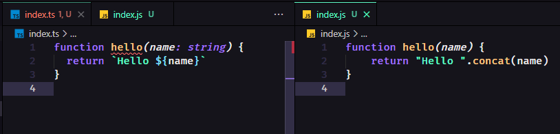

# O que é Typescript?

Como na própria documentação diz é um superset tipado para Javscript.

## Mas o que isso quer dizer?

Nós podemos continuar utilizando a sintaxe do js para o typescript, porém agora teremos que seguir algumas regras sobre como os tipos de valores serão utilizados. Por exemplo, se temos uma função com parâmetros, devemos colocar quais serão os tipos desses parâmetros, string, number, array, etc...
Isso ajuda muito principalmente na manutenção de código, pois ficará bem mais fácil de saber o que uma determinada função recebe depois que você ficar longe do código por 5 dias, rs. Durante o desenvolvimento também conseguimos visualizar esses erros de tipagem, se tentarmos passar uma string para uma função que só recebe números, o typescript nos informa que há um erro de tipagem, há outros benefícios também que veremos mais adiante.\
**Só lembrando que todo código js é executavel em typescript porém o contrário não ocorre.**

## Instalação

```sh
npm i typescript -D
ou
yarn add typescript -D
```

O -D serve para instalarmos como depêndencia de desenvolvimento.\
A escolha entre yarn e npm tanto faz, hoje os dois são bem semelhantes, não é algo para você se preocupar de início, estarei utilizando o yarn.

Temos outras pastas e arquivos dentro de typescript mas vamos focar nesses:

```sh
node_modules
  .bin
    tsc
    tsserver
  typescript
    bin
      tsc
      tsserver
```

O que aconteceu aqui foi que a pasta bin dentro de typescript foi movida para .bin para que podemos utilizar o npx ou yarn para executar esses binários.

o tsserver é utilizado pelos editores de texto para rodar o typescript em background checando o código\
Nós utilizaremos o tsc para compilar arquivo ```.ts``` para ```.js```.

## Executando o primeiro código

O nodejs não entende typescript então não podemos rodar ```node index.ts``` a não ser que esse arquivo index.ts só tenha a sintaxe javascript. Por exemplo, se o nosso arquivo conter apenas um ```console.log('hello world')``` irá executar normalmente, porém se começarmos a colocar a sintaxe do typescript, usando types em váriaveis, fuções, etc... o node não executará o arquivo.\
Então primeiro devemos compilar usando o tsc que está dentro da pasta node_modules/bin:

```sh
yarn tsc index.ts
```

Esse comando ira gerar um arquivo index.js, ai sim podemos executa-lo usando o comando:

```sh
node index.js
```

## Script mode

No script mode tudo funciona como um arquivo único, ou seja, se criarmos uma função chamada ```hello``` no nosso arquivo index.ts, quando compilarmos será gerado o arquivo index.js, o vscode ja sinaliza no arquivo index.ts que ja existe uma função com aquele nome:



## Module mode

Basta exportarmos ou importamos uma variavel, função, que o typescript assume que estamos utilizando modulos:

```ts
const name = 'Alexandre'

export default name
```

## tsconfig.json

Para criarmos uma configuração typescript para um projeto do zero, rodamos o seguinte comando:

```sh
yarn tsc --init
```

Um arquivo chamado tsconfig.json será criado na raiz do projeto.\
Vamos passar por alguns pontos desse arquivo:

- ```"target"```: qual a versão do ECMAScript(javascript) no ambiente que será executado o código. Isso vai depender muito de projeto pra projeto, vou deixar o valor como ```"ESNext"```:

```json
"target": "ESNext"
```

- ```"module"```
- ```"lib"```: especificar o que será usado no projeto, por exemplo, podemos colocar ```"ES2015"```, ou seja, o projeto ira usar recursos dessa versão do ECMAScript. Irei configurar com ```"ESNext"``` e ```"DOM"``` pra poder utilizar os recursos mais recentes e DOM para podermos manipular recursos HTML, onde o typescript fornecerá as tipagens para os elementos.

```json
"lib": [
  "ESNext",
  "DOM"
]
```

- ```"outDir"```: especifica o diretorio dos arquivos compilados, pois assim podemos colocar em uma pasta diferente dos arquivos do nosso projeto que ficará em src, vou deixar como ```"./dist"```:

```json
"outDir": "./dist"
```

- ```"strict"```: serve para habilitar os tipos de checagem, colocando como ```true```, todas as opções são habilitadas. Podemos ver as opções logo abaixo no arquivo. Caso queira configurar apenas algumas opções basta descomentar a opção desejada:

```json
// "noImplicitAny": true,
// "strictNullChecks": true,
// "strictFunctionTypes": true,
// "strictBindCallApply": true,
// "strictPropertyInitialization": true,
// "noImplicitThis": true,
// "useUnknownInCatchVariables": true,
// "alwaysStrict": true,
// "noUnusedLocals": true,
// "noUnusedParameters": true,
// "exactOptionalPropertyTypes": true,
// "noImplicitReturns": true,
// "noFallthroughCasesInSwitch": true,
// "noUncheckedIndexedAccess": true,
// "noImplicitOverride": true,
// "noPropertyAccessFromIndexSignature": true,
// "allowUnusedLabels": true,
// "allowUnreachableCode": true,
```
